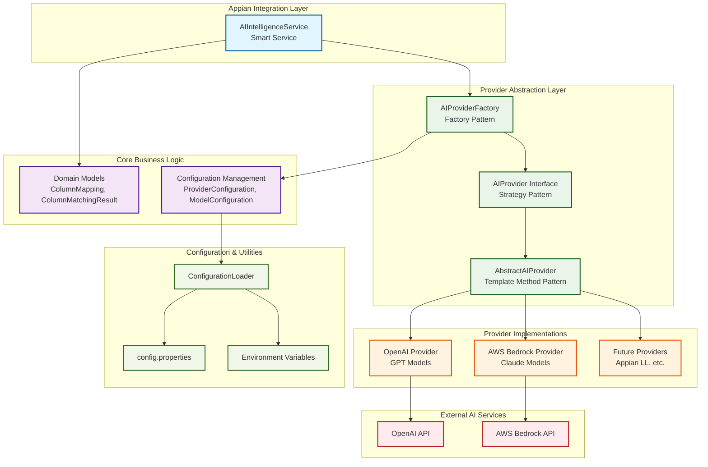
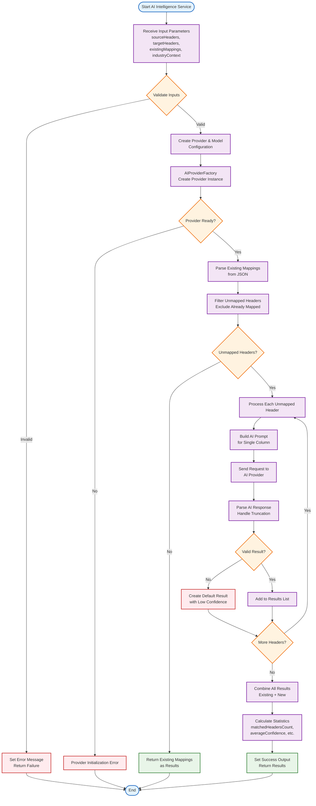

# AI Intelligence Plugin - Architecture Diagrams

This document provides visual representations of the AI Intelligence Plugin's architecture and process flow using Mermaid diagrams.

## High-Level Architecture

The AI Intelligence Plugin follows a modular, extensible architecture with clear separation of concerns and support for multiple AI providers.

## Process Flow

The column matching process follows a systematic workflow that handles input validation, AI provider selection, intelligent matching, and result processing.

## Key Design Patterns

The architecture implements several software engineering design patterns:

1. **Strategy Pattern**: `AIProvider` interface allows switching between different AI services
2. **Factory Pattern**: `AIProviderFactory` creates provider instances dynamically
3. **Template Method Pattern**: `AbstractAIProvider` defines common workflow structure
4. **Service Locator Pattern**: Uses `ServiceLoader` for automatic provider discovery

## Configuration Management

The plugin supports flexible configuration through:
- `config.properties` file
- Environment variables
- System properties
- Provider-specific parameters

## Extensibility

New AI providers can be easily added by:
1. Implementing the `AIProvider` interface
2. Extending `AbstractAIProvider` for common functionality
3. Adding provider configuration to `config.properties`
4. Registering the provider in `META-INF/services`

The plugin is designed to be production-ready with robust error handling, timeout management, and graceful degradation for various failure scenarios.
